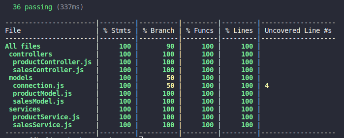
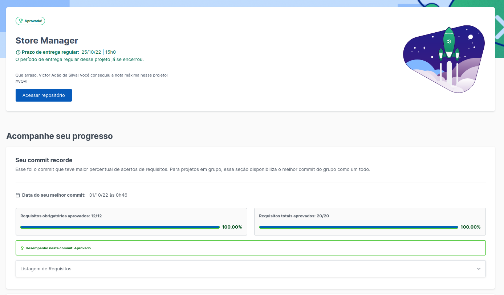

# Store Manager

Nesse projeto pude aprender mais sobre as rotas de um API, a como manipular suas queries e inserts, foi um bom aprendizado para minhas HardSkills, passei por bastante desafio nesse projeto, mas consegui meus 100% totais. Com ajuda do Sinon e Chai, trabalhei bastante com tests, onde obtive 100% de cobertura das ``` models ```, ``` services ``` e ```controllers```.

### Como iniciar o projeto na sua máquina 💻

- ``` git clone git@github.com:VictorSilva27/Store-Manager.git ``` (Clonar o repositório no local)
- ``` cd Store-Manager ``` (Entrar no repositório clonado)

### Rodando com Docker 🐋
- ``` docker-compose up -d ``` (Instalando as images do NodeJs e MySql)

Em caso de Erro de funcionamendo de Porta, altere as linhas das ports no arquivo ``` docker-compose.yml ```
- ``` docker exec -it store_manager bash ``` (Entrando no container)
- ``` npm install ``` (Baixando as dependências do projeto)
- ``` npm start ``` (Iniciando o projeto)

No seu terminal deve estar aparecendo algo como ``` Escutando na porta 3000 ```

### Criando e populando o banco de dados 🏦🎲

- ``` npm run migration ``` (Criando as tabelas e o banco)
- ``` npm run seed ``` (Populando o banco com os dados)

Agora copie e cola o link abaixo, no seu navegador: 
- ``` http://localhost:3000/products ``` (Caso você altere a porta, devera alterar na URL no lugar do ``` 3000 ``` )

Ou

- ``` http://localhost:3000/sales ```

### Como rodar os teste 🧪

- ``` npm run test:mocha ```



### Nota do Projeto ⭐⭐⭐⭐⭐

